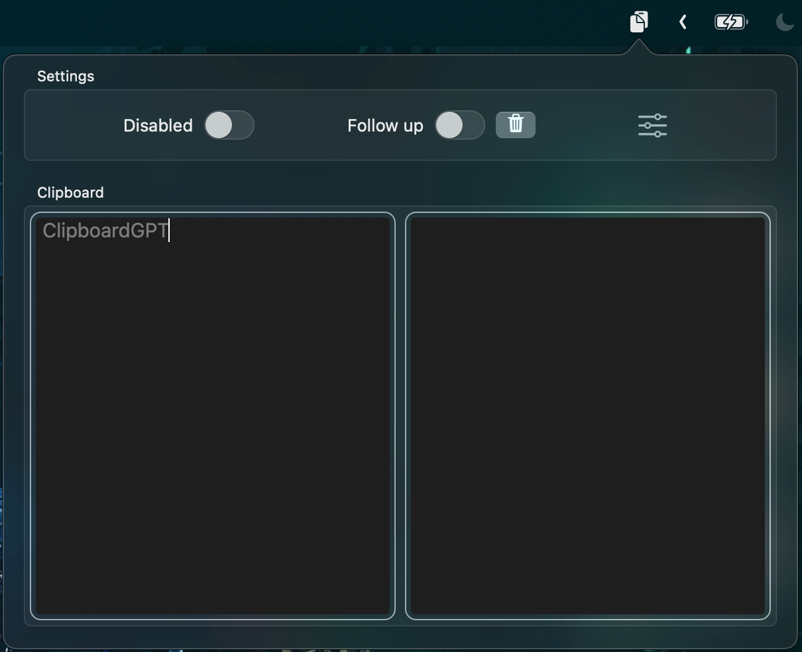

# Clipboard GPT

A mac app that sits in your menu bar and automates the clipboard content to chatGPT API and copy the response to your clipboard.

## Features

1. Custom **HotKey** and **Safe Word** to open/hide the app, enable/disable the automation, and follow/unfollow the conversation

2. Privacy mode to act as a timer app. It can also be enabled/disabled with a hotkey

3. Custom **API Key**  or **Endpoint** to use your own key or endpoint.
4. Custom **System Prompt** for chatGPT to fine tune the response.
5. Choose custom model from the list of available models.

Demo Video:

